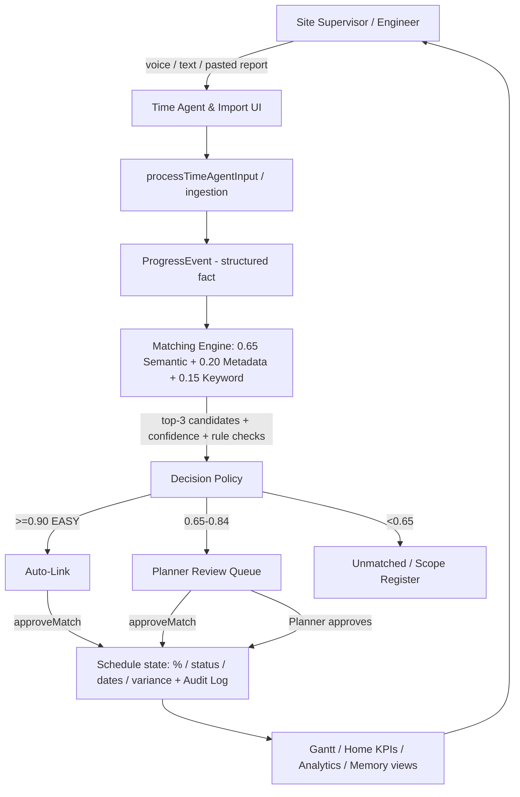
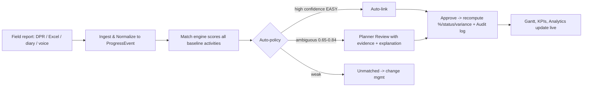

# SIH 2026 — CLAUDE PPT PROJECT BRIEF

> Feed this file directly into Claude to generate the 6-slide SIH 2026 submission PPT.
> This brief is a forensic analysis of the actual repository at `c:\Users\Eshan\Desktop\SIH\SIH-26` (foreground project "Oildex — Smart Schedule-Linking Layer"). Implemented vs simulated/planned functionality is clearly separated. Do not invent features beyond what is stated.

---

## 1. PROJECT IDENTITY

- **Project/Product Name:** Oildex — Smart Schedule-Linking Layer
- **One-line description:** A field-to-planner decision-support layer that turns messy daily progress reports (DPRs), site diaries, spool trackers, and voice logs into structured progress events, links them to L5/L6 Primavera-style baseline activities with confidence scores + human-in-the-loop planner approval, and reflects updates on baseline-vs-actual Gantt/analytics.
- **Problem this project solves:** Manual, error-prone reconciliation between unstructured field progress reports and the official baseline schedule causes stale % complete, un-auditable "actuals", and delayed detection of critical-path drift on Oil India capital/infrastructure projects.
- **Target users:** Site supervisors / engineers (reporting), project controls planners ("Er. Sharma" role), project managers/leadership (analytics), contractor field crews (voice/time agent).
- **Problem Statement ID:** PS 26122 (stated in repo: `metadata.json`, `index.html` footer, data comments).
- **Problem Statement Title:** Not given verbatim in the repo. Inferred from content: *"Intelligent Data Capture & Schedule-Linking Layer for Oil India Limited infrastructure projects — bridging DPRs/field logs to L5/L6 Primavera baseline schedules."* (Label as inferred; confirm against the official SIH problem statement.)
- **SIH Theme:** Not stated in repo — mark **unavailable**, confirm from SIH 2026 portal.
- **PS Category:** **Software** (pure client-side web app; no hardware).
- **Team ID:** Not in repo — fill from registration.
- **Team Name:** Not in repo — fill from registration.

---

## 2. EXECUTIVE SUMMARY

On live pipeline/plant construction sites, supervisors file progress in free-text DPRs, Excel spool trackers, site diaries and voice logs, while planners maintain a separate L5/L6 baseline schedule (Primavera-style) with discipline, area, dates, % complete and float. Keeping these in sync is manual, slow and non-auditable. Oildex is a working browser prototype that ingests such messy field text, normalizes each sentence into a structured "progress event" (discipline, action, tag, date, status, %), and runs a **deterministic scoring engine** that proposes the best-matching baseline activity by combining a synonym-aware text-similarity score, metadata (discipline/area/date-window) checks and keyword/entity-tag checks into a single confidence formula. High-confidence "easy" links auto-approve; ambiguous ones route to a **planner review queue** with explanation and rule checks; every approval deterministically mutates the schedule and writes an **audit log**; and a hand-built **Gantt, S-curve, delay taxonomy and institutional-memory view** visualize baseline vs actual. The differentiator is the **human-in-the-loop governance model with explainable, auditable linking** — the LLM/AI never writes to the schedule directly; governed application logic does. Primary beneficiaries are planning/controls engineers, site supervisors and project leadership at Oil India and similar EPC operators.

> ⚠️ Honesty note: this is a **100% client-side, mock-data prototype**. There is **no real AI/LLM, no backend, no database, no file upload/OCR, and no network call** in the code. Those surfaces are simulated/planned (see §9, §14).

---

## 3. PROBLEM → SOLUTION

| Problem / Pain Point | Our Solution | Result / Benefit |
|---|---|---|
| DPRs/diaries/trackers are free-text, multi-discipline, full of slang ("spool 24A-S03", "F11 pour", "cable Feeder-01") | Normalization model (types `SourceDocument` → `ProgressEvent`) with difficulty buckets EASY / PARAPHRASED / NOISY / AMBIGUOUS / UNMATCHED | Field language becomes structured, machine-comparable facts |
| Field terms don't literally match schedule names | Synonym-dictionary token expansion (erection≡install≡spool; pour≡concreting; hydrotest≡pressure test) | Higher text-similarity hits between report and baseline |
| Wrong-discipline/area/date matches cause bad auto-updates | Metadata rule checks (discipline ±0.50, area ±0.25, 7-day date window ±0.25) + rule-check grid | Candidate ranking respects schedule semantics |
| Blind auto-linking corrupts the schedule | Threshold policy: ≥0.90 + EASY auto-accepts; ≥0.85 auto-proposes; 0.65–0.84 → human `PLANNER_REVIEW`; <0.65 → `UNMATCHED` | Only safe links mutate schedule automatically |
| No audit trail / "who changed what and why" | Every approve/reject/override/flag writes an `AuditLogEntry` (actor, old/new value, evidence sentence, confidence) | Tamper-evident, planner-governed updates |
| Stale % complete and drift detected too late | Deterministic recompute of % / status / varianceDays + SPI on approval; reactive Gantt, S-curve, critical-path & delay taxonomy views | Earlier visibility of slippage (e.g., Line 24A hydrotest +1d, SPI 0.92) |
| Field staff won't type forms | Time Agent: text or real browser voice (Web Speech API) → auto-parse + confirmation card | 1-tap field reporting |

---

## 4. CORE FEATURES

**Implemented features (deterministic, functional, stateful):**

- **Feature:** Schedule-Linking Matching Engine (`src/services/scheduleMatchingEngine.ts`)
  - What it does: For each event, scores all 16 baseline activities and returns top-3 candidates + decision + human-readable explanation.
  - How: `final = 0.65·semantic + 0.20·metadata + 0.15·keyword`, where semantic = synonym-expanded token Dice/Jaccard hybrid (clamped 0.08–0.98), metadata = discipline/area/date-window bonuses, keyword = entity tags (24A, F-11, 28B, K-101…) and action words. Rules: disciplineMatch, areaMatch, dateWindowValid, statusTransitionValid.
  - User benefit: Explainable candidate ranking; judges can trace *why* a link was made.
  - Status: **IMPLEMENTED**

- **Feature:** Planner Review Queue with governance actions (`MatchReview.tsx` + context)
  - What: Master–detail queue of match records; approve / override-candidate / reject / flag-as-unmatched with notes.
  - How: `approveMatch` recomputes % / status / actualStart-Finish / varianceDays, bumps evidence count, appends audit entry, nudges overall % +0.4 and SPI; `overrideMatch`, `rejectMatch`, `flagUnmatched` handle edge decisions.
  - Benefit: Human-in-the-loop control; matches SIH "planner governance" requirement.
  - Status: **IMPLEMENTED** (has known UI field bugs — see §13/§17)

- **Feature:** Ingestion of a new document triggers matching + policy auto-approval (`ingestNewDocument`)
  - How: prepends doc/events/matches, then auto-approves new `AUTO_ACCEPTED` (≥0.90 + EASY) matches.
  - Status: **IMPLEMENTED** (simulated source: ImportCenter fabricates a single event with fake 600 ms delay; no real file/PDF parsing — see §14)

- **Feature:** Baseline-vs-Actual Gantt (`GanttChart.tsx`)
  - What: hand-rolled CSS-grid Gantt (no chart lib): grey baseline bars vs green/rose/amber actual bars, variance tags, data-date cut-off line, discipline filter, critical-only toggle, search; row click opens activity drawer.
  - How: computes bar geometry from `activities` planned/actual dates via `dateToPercent`; fully reactive to state changes.
  - Status: **IMPLEMENTED**

- **Feature:** Activity detail drawer (`ActivityDetailDrawer.tsx`) — baseline/actual matrix, predecessors/successors, linked field evidence, per-activity audit history. Status: **IMPLEMENTED**

- **Feature:** Time Agent voice + conversational reporting (`TimeAgent.tsx`)
  - What: chat console; type text or press mic; a confirmation card → "Confirm & Log" calls `approveMatch`.
  - How: `processTimeAgentInput` is a **deterministic keyword parser** (24a/spool→PIPING erection; f11/pour→CIVIL; cable/feeder→ELECTRICAL; hydrotest→HOLD…) → builds event → runs matching engine. **Real speech**: uses browser Web Speech API (`SpeechRecognition`/`webkitSpeechRecognition`) if available; otherwise falls back to a simulated 1.4 s "listening" that fills a canned prompt.
  - Status: **IMPLEMENTED** (voice = real-when-browser-supports, else simulated; parsing is keyword-based, not NLP)

- **Feature:** Guided 3-minute demo/pitch tour (`DemoTourModal.tsx`) — 8 steps that navigate tabs and perform one real approval. Status: **IMPLEMENTED**

- **Feature:** Navbar with 9-tab navigation, pending-review badge, reset-to-benchmark. Status: **IMPLEMENTED**

- **Feature:** Institutional Memory + Audit Trail views (`ProjectMemory.tsx`). Memory keyword search over 4 mock items is **real**; audit tab renders real `auditLogs`.
  - ⚠️ The **"Ask the Project" Q&A chat is SIMULATED**: an `if/else includes()` chain returns canned answers and prints theatrical "simulated SQL" + "PostgreSQL Table: …" + "DB Connected" traces. No DB/AI exists.
  - Status: **PARTIALLY IMPLEMENTED** (memory/audit views real; Q&A simulated)

- **Feature:** Analytics S-curve / delay taxonomy / contractor scorecard (`Analytics.tsx`) — presentational; SVG S-curve and delay rows are **hard-coded**, not derived from live state. Status: **PARTIALLY IMPLEMENTED** (display only)

- **Feature:** Workflow wizard (`WorkflowView.tsx`) — 4-stage stepper Ingestion → AI Extraction → Semantic Match → Baseline Sync with runnable samples and "Approve & Link". End-to-end deterministic demo. Status: **IMPLEMENTED** (as a guided simulation; "AI Extraction" stage only displays pre-built events)

- **Feature:** AI Extraction explorer (`AIExtraction.tsx`) — difficulty-tier filter + event JSON inspector + copy-to-clipboard. Status: **IMPLEMENTED as a viewer** — no extraction model runs here; events are pre-baked mock objects

- **Feature:** KPI dashboard (`ProjectHome.tsx`) — cards, quick tiles, demo launcher. Status: **IMPLEMENTED** but has a property-name bug rendering `undefined%` and several hard-coded stats (see §13)

**Top features that deserve PPT space (ranked):**
1. **Planner-governed matching pipeline** (scoring formula + 4-tier decision policy + rule checks) — the core idea.
2. **Explainable, auditable schedule mutation** (evidence sentence + confidence + audit log; "AI never writes directly").
3. **Time Agent voice → structured event → review** (frontline friction reduction).
4. **Baseline vs actual Gantt + drift visualization** (immediate visual wow, judge-friendly).
5. **Institutional memory / delay-taxonomy Q&A vision** (best shown as *envisioned*, not as working AI).

---

## 5. INNOVATION / UNIQUENESS

> Framing rule for slides: present the genuinely novel *system design* (governed, explainable, auditable linking), while being clear that semantic matching is currently a deterministic dictionary-based engine and that LLM/embedding integration is the stated roadmap, not the current runtime.

- **Innovation 1: "LLM may propose, but only governed logic commits" — human-in-the-loop confidence policy**
  - Why different: most auto-scheduling tools either write straight to the schedule or dump everything to a human. Oildex tiers decisions (auto-accept ≥0.90 EASY / auto-propose ≥0.85 / review 0.65–0.84 / unmatched <0.65) and every commit appends an audit entry.
  - Existing/common alternative: manual planner re-keying, or naive keyword search with no governance.
  - Advantage: safe automation, trust, and full auditability — exactly what an EPC controls team demands.

- **Innovation 2: Difficulty-bucketed benchmarking of real field language (EASY / PARAPHRASED / NOISY / AMBIGUOUS / UNMATCHED)**
  - Why different: each seeded event has a `groundTruthActivityId`, letting match accuracy be measured per difficulty tier (the UI labels match top-3 recall / auto-link precision concepts, though computed metrics are only in a dead `BenchmarkMetrics` type).
  - Advantage: an honest test harness story for "how well do we catch paraphrased and ambiguous site language."

- **Innovation 3: Synonym/entity-expanded similarity tuned to construction vocabulary**
  - Why different: token expansion over hand-built engineering synonym clusters (erection≡installation≡spool; pour≡concreting≡cast; tag-aware 24A/F-11/K-101) plus Dice/Jaccard hybrid beats raw keyword search on site slang.
  - Advantage: robust to real DPR phrasing without needing embeddings at runtime.
  - ⚠️ Do **not** claim BGE-M3/embeddings/vector DB are running — they are only the aspirational design label in comments/UI ("BGE-M3 style").

- **Innovation 4: Multi-modal intake concept in one surface** (DPR PDF text, Excel spool tracker, site diary/ASR voice text, live Time Agent) — **as a workflow concept**.
  - ⚠️ Only the *text* path is wired; PDF/Excel/ASR content is pre-baked mock data.

- **Innovation 5: Institutional-memory Q&A as governance learning loop** (turn delay patterns into reusable norms + mitigations) — **envisioned/roadmap**, currently simulated with canned text. Present as future value, not current capability.

---

## 6. TECH STACK

- **Frontend:** React 19 (`react`, `react-dom`), TypeScript ~5.8, Vite 6 (`vite`, `@vitejs/plugin-react`), Tailwind CSS v4 (via `@tailwindcss/vite`), `lucide-react` icons, `motion` (Framer Motion 12) for animations. Google Fonts (IBM Plex Mono, Plus Jakarta Sans).
- **Backend:** **None in code.** `express` + `dotenv` exist in `package.json` but are unused template leftovers (the `clean` script even removes `server.js`, which does not exist). All logic runs in the browser.
- **Database:** **None.** In-memory React `useState` seeded from mock arrays. No `localStorage`/IndexedDB; refresh resets. "PostgreSQL" is theatrical UI copy in `ProjectMemory.tsx`.
- **AI/ML:** **None invoked at runtime.** `@google/genai` is a declared dependency and `metadata.json` declares `MAJOR_CAPABILITY_SERVER_SIDE_GEMINI_API`, but nothing imports it and zero network calls exist. Only a browser **Web Speech API** voice attempt (with simulated fallback).
- **APIs:** Web Speech API (`SpeechRecognition`/`webkitSpeechRecognition`, best-effort). No REST/LLM/embedding calls.
- **Authentication:** None.
- **Cloud/Hosting:** None in repo. README/metadata reference the Google AI Studio / Cloud Run template origin; `.env.example` has placeholder `GEMINI_API_KEY`/`APP_URL` not read by code.
- **DevOps:** Vite dev/build/preview scripts; `tsc --noEmit` lint script. No CI/CD config.
- **Libraries/Frameworks:** React Context (state), Tailwind, Lucide, Motion. **No chart library** — Gantt/S-curve are hand-drawn (CSS grid / SVG).
- **External services:** None at runtime (only Google Fonts CDN in `index.html`).
- **Hardware/IoT:** None (only the browser microphone via Web Speech API).
- **Other:** Fonts; `@types/node`, `tsx` (dev tooling only).

---

## 7. SYSTEM ARCHITECTURE

**Reverse-engineered actual architecture (all client-side):**
- **User/client layer:** Browser app (Vite dev on :3000). Three personas implied by UI roles: Supervisor (Time Agent, import), Planner (review queue, approve), Leadership (home KPIs, analytics).
- **Frontend:** React SPA. `App.tsx` holds a 9-tab state switch (no router). `ProjectProvider` (`src/context/ProjectContext.tsx`) is the single source of truth, exposing actions: `approveMatch`, `overrideMatch`, `rejectMatch`, `flagUnmatched`, `ingestNewDocument`, `processTimeAgentInput`, `resetToBenchmark`.
- **AI/ML layer:** Present only as **domain logic** — `scheduleMatchingEngine.ts` (deterministic scoring + policy). No model server.
- **Database:** Mock seed modules act as the "DB": `src/data/mockSchedule.ts` (project/WBS/activities), `src/data/syntheticDPRs.ts` (documents/events), `src/data/analyticsAndMemory.ts` (delays, memory, audit).
- **External APIs:** Web Speech API (optional mic input) only.
- **Deployment:** Not configured (intended: Vite static build; metadata declares server-side Gemini capability as future).

**Data flow:** User input text/voice → `processTimeAgentInput`/mock docs → `ProgressEvent` → `matchEventToActivities` → top-3 candidates + decision → policy (auto-link or queue) → `approveMatch` mutates `activities` + writes `auditLogs` + nudges KPIs → views (Gantt/drawer/review/home) re-render from context.

---

## 8. END-TO-END WORKFLOW

**User journey:** A field supervisor speaks or types "Line 24A started this morning, spool S03 erected" into the Time Agent (or a planner ingests a DPR/excel/site-diary). The system parses it into a structured event (discipline PIPING, action ERECTION, tag Line 24A/Spool 24A-S03, date = dataDate, ~70% IN_PROGRESS). The matching engine scores it against every baseline L5 activity, producing top-3 candidates, a final confidence, rule checks and an explanation. High-confidence easy events auto-link; ambiguous ones (like this one, the PS's hero "Line 24A" case) land in the planner review queue. The planner reviews evidence and candidate(s), then approves (or overrides/rejects/flags). Approval deterministically updates the activity (% → 70, status IN_PROGRESS, actual start, variance, +1 evidence), writes an audit entry, bumps overall % and SPI, and the Gantt/dashboard/drawer react immediately. A rejected/seepage "scope variation" case is flagged to a (future) change-management register.

---

## 9. AI/ML DETAILS

**"AI/ML is not currently implemented."** (There is no running model, LLM, embedding, RAG, vector DB, training, or classification model.)

What exists instead — and how to describe it honestly:
- **Deterministic semantic-similarity surrogate** (in `scheduleMatchingEngine.ts`): hand-authored engineering synonym clusters expand tokens, then a Dice/Jaccard token-overlap gives a 0–1 "semantic" score. It is labeled "BGE-M3 style" in comments/UI but uses **no embeddings and no BGE-M3 runtime**.
- **Weighted scoring formula** `final = 0.65·semantic + 0.20·metadata + 0.15·keyword` (metadata: discipline/area/date-window; keyword: entity tags + action verbs) — presented in code comments as the "EXACT PS 26122 FORMULA."
- **Threshold decision policy** producing `AUTO_ACCEPTED / AUTO_PROPOSED / PLANNER_REVIEW / UNMATCHED`.
- **Keyword/pattern parser** for Time Agent text and Q&A (`includes()` chains) — not NLP.
- **Browser speech-to-text** (Web Speech API) with simulated fallback — no server-side ASR (the UI's "Whisper ASR" is cosmetic).
- **Postulated/roadmap AI surfaces (label as Planned/Future):** Gemini/LLM-driven extraction & normalization, BGE-M3 embeddings + vector similarity, natural-language Q&A over a real PostgreSQL institutional-memory store, and a server-side Gemini API (the declared-but-unimplemented `MAJOR_CAPABILITY_SERVER_SIDE_GEMINI_API`).

**Why AI is (arguably) necessary** (design argument, fine to make in the deck): unstructured, slang-heavy, multi-format field text cannot be reliably normalized by fixed rules at scale; embeddings + an LLM are the credible path to robust extraction and matching — which is precisely why the architecture already separates "extraction/normalization" and "semantic matching" as replaceable stages behind the deterministic governance core.

---

## 10. DATA

- **What enters:** free-text DPR paragraphs, Excel spool-tracker rows, site-diary/ASR transcripts, live typed/voice supervisor sentences, and custom pasted text. (Represented by `SourceDocument.rawText`.)
- **Where it comes from:** mock seed data (`src/data/syntheticDPRs.ts`: 3 realistic OIL documents: `DOC-DPR-2026-09-05` PDF, `DOC-XLS-PIPING-TRACKER`, `DOC-SITE-DIARY-01`); plus user-typed input.
- **How it is processed:** text → `ProgressEvent` normalization (discipline/action/tag/date/status/quantity/difficulty, optional `groundTruthActivityId` for benchmarking) → matching engine → policy decision → on approval, deterministic schedule recompute + audit entry.
- **Where stored:** React context state only (in-memory). No persistence; "Reset to benchmark" reseeds from mock modules.
- **What comes out:** updated activity % complete/status/dates/variance, SPI & overall progress, matches with candidates & confidence, audit log, Gantt bars, S-curve, delay taxonomy, memory cards.
- **Datasets used:** none external; only the hand-authored mock dataset (1 project `OIL-DNPL-EXP-04`, 16 L5 activities, 6 events, 4 delay records, 4 institutional-memory items, 3 audit seeds). The `BenchmarkMetrics` interface (accuracy/recall/latency metrics) is defined but **unused** — metrics are not yet computed.
- **Privacy/security in code:** essentially none (no auth, no storage, no transmission). Domain realism only (fictional-but-plausible OIL project names/codes). No PII handled.

---

## 11. FEASIBILITY

- **Technical feasibility:** HIGH for the deterministic core — pure client-side TS, no infra needed; runs today in a browser. The LLM/embedding layer is a well-trodden integration (Gemini API + embeddings), feasible to add.
- **Infrastructure feasibility:** HIGH — static hosting suffices today; a thin server is only needed for secret-safe Gemini calls, file parsing (PDF/Excel), and a DB later.
- **Cost feasibility:** HIGH today (zero infra). Gemini/embedding/vector-DB costs are modest at pilot scale (hundreds of activities/events/day).
- **Deployment feasibility:** MEDIUM-HIGH — Vite static build is trivial; enterprise EPC rollout (SSO, on-prem, Primavera P6 integration) is a larger effort and is future scope.
- **Scalability:** MEDIUM — the scoring engine is O(events × activities) in-memory, fine to thousands; beyond that, indexing/embeddings + a DB are needed (roadmap).
- **Maintenance:** MEDIUM — synonym clusters and thresholds are currently hand-maintained; should move to embedding models + data-driven thresholds.

| Challenge / Risk | Why it could happen | Mitigation strategy |
|---|---|---|
| No real extraction/OCR yet; PDF/Excel/ASR are mocked | Only text path is implemented | Pilot with text/voice first; add Gemini/parse-API for files (roadmap) |
| "Semantic" match can mis-handle true paraphrasing at scale | Token overlap is brittle vs real slang | Swap stage to embeddings (BGE-M3/Gemini) behind same interface; keep human review for 0.65–0.84 |
| Judges may see AI/DB claims as overstated | UI copy already claims Gemini/Whisper/PostgreSQL | Present current engine as "deterministic v1"; label LLM/embeddings/DB as the validated architecture for scale |
| No persistence — refresh loses planner decisions | In-memory state only | Add localStorage/IndexedDB now, real DB later; show audit trail persisting |
| Real voice depends on browser support | Web Speech API availability varies | Keep text fallback (exists); server ASR later |
| Wrong auto-approvals erode trust | Auto-link at ≥0.90 | Governance + audit + evidence on every link (already core) |

---

## 12. IMPACT

- **Primary users (planners/controls):** faster, evidence-backed, auditable schedule updates; less manual re-keying; early warning of critical-path slippage.
- **Field supervisors:** one-tap/one-sentence reporting instead of forms — higher quality, more timely progress data.
- **Organizations (Oil India / EPCs):** single governed layer between field execution and the baseline schedule; "actuals" with provenance; institutional memory retains lessons (delay patterns → mitigations).
- **Society/government (PS context):** more predictable infrastructure delivery and capital-project governance — narrative-level, avoid invented stats.
- **Economy:** reduced project slippage/claims disputes via clean actuals & auditability (qualitative; no fabricated figures).
- **Environment:** not materially applicable (no environmental claim in code) — optionally note reduced travel/paper via digital reporting only as a soft point.
- **Scalability & deployment:** from one pipeline project's 16 activities to a program of projects/sectors (oil & gas, power, infra) by scaling activities + adding real parsing/embeddings/DB; the governance + matching architecture is domain-agnostic to schedule-driven construction.

> Do **not** invent numbers (no "X% reduction", "₹Y saved", "N projects" claims — the repo contains none).

---

## 13. SECURITY / PRIVACY / RELIABILITY

**As actually implemented:**
- **Authentication:** none. **Authorization:** role distinctions are only cosmetic strings ("Er. A. Sharma (Lead Project Controls)").
- **Data protection / privacy:** none needed — no data leaves the browser, no storage; only the mock document/mic. The mic is only used if the user clicks the mic (best-effort SpeechRecognition), with `metadata.json` requesting `microphone` permission.
- **API security:** n/a (no API calls). Server-side Gemini capability is declared but unimplemented → **must** be added secret-safe server-side, never in the client (that's exactly why a backend is future scope).
- **Input validation:** minimal — Time Agent/Import do `includes()` heuristics; no sanitization need today since there is no storage/backend. SQL strings are display-only.
- **Error handling:** light — try/catch around SpeechRecognition construction; otherwise minimal.
- **Reliability:** in-memory only → refresh wipes decisions (deliberate demo reset), but not production-grade.
- **Known code weaknesses to own up to:** (1) `ProjectHome.tsx` reads `projectInfo.actualProgress/plannedProgress` (fields don't exist → shows `undefined%`), plus hard-coded "0.92", "4 Sources", "-5.6%", "ACT-PIP-024". (2) `MatchReview.tsx` queue card reads `m.rawSourceExcerpt/m.discipline/m.eventDate` that don't exist on `MatchRecord` (should be `m.event.*`) → blank fields. (3) `rejectMatch` writes an audit entry with action `PLANNER_APPROVED` (should be a REJECT action). (4) Several UI strings reference non-existent activity IDs (`ACT-PIP-024`, `ACT-MEC-050`…; real IDs are `PIP-L5-024` etc.). (5) Dead code: `BenchmarkMetrics`, `presetBenchmarkReports`, `wbsNodes` unrendered.
- **Security improvements to present as future scope (not as existing):** role-based auth (supervisor/planner/admin), audit-keyed tamper-evidence, secret-safe server for Gemini, sanitization on a real DB, per-project tenancy, and enterprise SSO.

---

## 14. CURRENT IMPLEMENTATION STATUS

**IMPLEMENTED (working, deterministic, in the browser):**
- Matching engine with 0.65/0.20/0.15 scoring + synonym/entity expansion + rule checks + explanation.
- 4-tier decision policy (auto-accept / auto-propose / review / unmatched).
- Planner governance: approve, override, reject, flag + real audit-log writes + deterministic schedule recompute (%, status, dates, variance, SPI).
- Ingestion path that re-runs matching and auto-approves high-confidence easy links (`ingestNewDocument`).
- Baseline-vs-actual Gantt + activity detail drawer + home KPI tiles.
- Time Agent text path end-to-end (parse → match → confirm → schedule update); real browser voice **when supported**, else simulated.
- Guided 8-step demo tour; navbar 9-tab navigation with pending-review badge; reset-to-benchmark.
- Memory cards + audit-trail views (display of real arrays); event JSON inspector.

**PARTIALLY IMPLEMENTED / SIMULATED:**
- "AI Extraction": shows pre-baked normalized events; no extraction model runs.
- Import Center "ingestion": fabricates one event with a fake 600 ms delay; no real PDF/Excel parsing or file upload.
- Analytics S-curve / delay taxonomy / contractor scorecard: static/hard-coded, not live from state.
- Time Agent voice: real only if the browser offers SpeechRecognition, else simulated auto-fill.
- Project "Q&A": canned keyword answers + simulated SQL/"PostgreSQL" traces (theatrical).

**PLANNED / FUTURE SCOPE:**
- Real LLM (Gemini) extraction/normalization and Q&A (server-side Gemini API capability is declared in `metadata.json` but not implemented).
- BGE-M3 / embedding-based semantic matching + vector store.
- Backend (Express) + PostgreSQL persistence of activities/events/matches/audit/memory; `.env.local`/`GEMINI_API_KEY` wiring.
- Real PDF/Excel parsers and server-side ASR ("Whisper").
- Auth/RBAC, multi-project tenancy, computed benchmark metrics (`BenchmarkMetrics`), and Primavera P6 XML/export integration.

---

## 15. RESEARCH & REFERENCES

*Only credible, genuinely relevant sources; where the repo names a technology but does not use it, it is marked as reference/roadmap.*
- **Smart India Hackathon 2026 official portal** — sih.gov.in (Gov. of India). Why: the SIH platform defines PS 26122, rules, and judging; verify exact PS title/theme there. *(Repo references "SIH PS 26122".)*
- **Oracle Primavera P6 documentation** — docs.oracle.com (Primavera P6 Professional). Why: the L5/L6 activity model, baseline vs actual, % complete, SPI/float and data-date concepts the prototype mirrors. *(Concepts used throughout data & types.)*
- **Project Management Institute (PMI)** — Earned Value Management & SPI (`spi = EV/PV`). Why: SPI 0.92 and planned-vs-actual variance are EVM terms used in `ProjectInfo`/KPI copy.
- **BAAI BGE-M3 technical report (arXiv:2402.03216)** — Why: the aspirational multilingual embedding model named in the UI/commentary for the semantic-matching stage (roadmap, not runtime). *Label as reference for the planned matching upgrade.*
- **Google Gemini API documentation (@google/genai)** — ai.google.dev. Why: declared dependency + declared server-side capability; the roadmap LLM for extraction/Q&A. *(Dependency present; unused in code — roadmap.)*
- **MDN Web Speech API** — developer.mozilla.org (SpeechRecognition). Why: the only real browser API wired in `TimeAgent.tsx` (voice, with fallback).
- **React 19 / Vite 6 / Tailwind CSS v4 / TypeScript official docs** — Why: the actual implemented stack (state via React Context; build via Vite; UI via Tailwind; typed domain model via TS).
- **Dice–Sørensen coefficient & Jaccard index (set similarity)** — Why: the implemented `computeSemanticSimilarity` is exactly a Dice/Jaccard hybrid over expanded token sets.
- *(Dataset note: no external dataset is used; all data is the repo's hand-authored mock set. Do not claim public datasets.)*

---

## 16. STRONGEST SIH SELLING POINTS (ranked)

1. **Governed, explainable, auditable linking core** — "LLM may propose, governed logic commits": confidence tiers + planner approval + per-change audit trail with source evidence. Judges see a *real, working, defensible* mechanism, not a demo of a prompt.
2. **A concrete, working prototype** — a real React app with 9 views, an actually-run scoring engine, live schedule mutation and a reactive Gantt; it runs today with zero infra.
3. **Real domain authenticity** — OIL Duliajan/Numaligarh pipeline project, DPR/Excel/site-diary/voice field artifacts, L5/L6 Primavera-style activities with critical path, float, EVM SPI, TPI/test-pack delay causes. Judges can immediately see the field problem.
4. **Honest difficulty-tiered benchmark design** — EASY/PARAPHRASED/NOISY/AMBIGUOUS/UNMATCHED events with ground-truth labels is a credible evaluation story for extraction+matching quality.
5. **Frictionless frontline capture (Time Agent)** — one sentence or a spoken update → structured event → confirm card; addresses the "supervisors won't use forms" reality.
6. **Clear, credible AI roadmap** — deterministic v1 now; swap extraction/matching stages for Gemini + BGE-M3 embeddings behind the same governance core. This is a strength when framed honestly.
7. **Domain-agnostic, scalable pattern** — the governed schedule-linking layer transfers to any schedule-driven construction/infrastructure program (oil & gas, power, highways, water).

---

## 17. JUDGE QUESTIONS / WEAKNESSES

1. **"Is there any real AI here, or is it mocked?"**
   Honest answer: Extraction/Q&A/semantic-vs-embeddings are currently deterministic simulations; the genuinely novel part — governed, explainable, auditable linking — is fully working code. AI integration is the stated next stage, and the architecture isolates those stages for easy replacement. (Weakness → frame "deterministic v1 → AI-ready core".)
2. **"Where is the backend/database? Where does data persist?"**
   Answer: fully client-side today; state is in React context. Production plan: thin server + PostgreSQL for activities/events/matches/audit/memory; metrics type is already designed. (Be upfront it's a prototype boundary.)
3. **"How do you actually parse a PDF or Excel file?"**
   Answer: not yet — those are represented as mock text documents. Real parsers (pdf/parse, spreadsheet parsers) plus an LLM extraction stage are the integration task. (Weakness → roadmap.)
4. **"How accurate is your matching? Show numbers."**
   Answer: the benchmark harness (difficulty labels + ground-truth IDs) is designed and `BenchmarkMetrics` defined, but accuracy numbers aren't computed yet; we can run the seeded 6-event set live and show the decision per tier. (Own the gap; show live demo instead of fake stats.)
5. **"What's wrong if it auto-accepts a wrong link?"**
   Answer: auto-accept only fires at ≥0.90 confidence on EASY events; everything else needs a planner; every change has an audit row with the evidence sentence and an override path. (Strong point.)
6. **"Why not just use an LLM to do everything?"**
   Answer: because for schedule governance you need determinism, explainability and audit — an LLM proposing while rules commit gives the best of both; we keep the AI as a swappable stage.
7. **"How does this connect to Primavera P6 (the real system)?"**
   Answer: not yet — the L5/L6 model, dates, float and data-date mirror P6 semantics, and a P6 XML import/export is roadmap. (Weakness → roadmap + show the model fidelity.)
8. **"Voice input — is that real?"**
   Answer: we use the browser Web Speech API when available and fall back to a simulator in unsupported browsers; production would use server ASR. Demo the text path reliably.
9. **"Who authorizes schedule changes? Security?"**
   Answer: current prototype has role *labels* only; real auth/RBAC and multi-user audit are production scope. Design intent is supervisor-captures → planner-approves.
10. **"There are visible bugs — home shows 'undefined%', review cards show blanks, some activity IDs in text don't exist."**
    Answer: acknowledge candidly; these are prototype UI/data-consistency bugs we are fixing before final submission (list them). Fixing them is cheap and removes judge distraction.

---

## 18. FINAL 6-SLIDE CONTENT PLAN

### SLIDE 1 — TITLE PAGE
- **PURPOSE:** Instantly situate the submission: problem, theme, and a professional identity.
- **CONTENT (concise bullets):**
  - Problem Statement ID: **PS 26122** · Category: **Software** · SIH 2026
  - Theme: *(fill from portal — not in repo)*
  - Team ID / Team Name: *(fill)*
  - Product: **Oildex — Smart Schedule-Linking Layer** (Oil India Limited infrastructure projects)
  - One-liner: "Bridges messy DPRs & field logs to L5/L6 baseline schedules with governed, explainable linking."
  - A clean screenshot of the app's home/overview.
- **VISUAL:** App home dashboard screenshot as hero background or side panel.
- **KEY MESSAGE:** *A governed, explainable bridge between field progress and the baseline schedule for PS 26122.*

### SLIDE 2 — PROPOSED SOLUTION / IDEA
- **PURPOSE:** Make the judge feel the pain and "get" the idea in 30 seconds.
- **CONTENT:**
  - Problem: DPRs/spreadsheets/voice logs are unstructured; planners re-key manually → stale % complete, un-auditable actuals, late drift detection (SPI 0.92, Line 24A +1d).
  - Solution: Ingest & normalize any field text → progress events; score-match to baseline activities; auto-link only when safe, else planner review.
  - Innovation: "AI may propose — governed logic commits"; evidence + audit on every change.
  - Governance workflow: auto-accept ≥0.90 · propose ≥0.85 · review 0.65–0.84 · unmatched <0.65.
- **VISUAL:** Pain→Solution 2-column infographic + 4-tier decision policy strip.
- **KEY MESSAGE:** *Turn messy field reports into governed, auditable schedule updates — safely and fast.*

### SLIDE 3 — TECHNICAL APPROACH
- **PURPOSE:** Prove it is real and show architecture + working prototype.
- **CONTENT:**
  - Stack: React 19 + TypeScript + Vite + Tailwind; hand-built Gantt/SVG; Web Speech API.
  - Pipeline: Ingest → Normalize (difficulty buckets) → Match (0.65 semantic + 0.20 metadata + 0.15 keyword, rule checks, top-3 + explanation) → Policy → Governed commit + audit → live Gantt/KPIs.
  - Semantic v1: synonym/entity-expanded token similarity (Dice/Jaccard); embeddings/BGE-M3 + Gemini = AI-ready upgrade path.
  - Working prototype: 9 screens, real running demo of the ambiguous "Line 24A spool" case through planner approval.
- **VISUAL:** Architecture/flow diagram + small UI screenshots.
- **KEY MESSAGE:** *A working, deterministic v1 with an AI-ready, swappable architecture.*

### SLIDE 4 — FEASIBILITY & VIABILITY
- **PURPOSE:** Convince judges it can ship and scale in the real world.
- **CONTENT:**
  - Today: zero-infra browser prototype; deterministic core proven.
  - Pilot path: text + voice first on one project; no heavy integration needed.
  - Scaling path: add server + PostgreSQL (audit/memory persistence), PDF/Excel parsers, embeddings, P6 XML import.
  - Risks & mitigations: accuracy → human review tier; real-world parsing → staged rollout; trust → full audit trail.
- **VISUAL:** 3-stage roadmap (Pilot → Scale → Enterprise) + risk/mitigation mini-table.
- **KEY MESSAGE:** *Ship as a zero-infra pilot today; scale to enterprise with a clear, low-risk path.*

### SLIDE 5 — IMPACT & BENEFITS
- **PURPOSE:** Show value to the user/organization/nation — qualitatively, honestly.
- **CONTENT:**
  - Planners: faster, evidence-backed, auditable updates; early slippage alerts.
  - Supervisors: 1-sentence/voice reporting — no forms.
  - Organization: governed actuals with provenance; institutional memory turns delays into lessons.
  - Economy/society: predictable infrastructure delivery, fewer disputes (no invented stats).
  - Scalability: schedule-driven construction anywhere — oil & gas, power, highways, water.
- **VISUAL:** Personas→benefit matrix / impact diagram; representative Gantt "before/after drift" screenshot.
- **KEY MESSAGE:** *Better, faster, auditable project delivery — from one pipeline to national infrastructure programs.*

### SLIDE 6 — RESEARCH & REFERENCES
- **PURPOSE:** Ground the solution in credible standards/sources.
- **CONTENT:**
  - SIH 2026 official problem statement (PS 26122) — sih.gov.in.
  - Primavera P6 / project-controls concepts (baseline, SPI, float, data date).
  - EVM standards (PMI) for SPI/variance used in KPIs.
  - BGE-M3 (arXiv:2402.03216) & Gemini API — planned semantic/LLM stages.
  - MDN Web Speech API — implemented voice path.
  - React/Vite/Tailwind/TypeScript docs — implementation stack.
- **VISUAL:** Clean reference list in two columns (standard → why relevant).
- **KEY MESSAGE:** *Grounded in established project-controls standards, with a credible AI upgrade path.*

---

## 19. CLAUDE DESIGN INSTRUCTIONS

Create a professional, judge-ready **SIH 2026 PowerPoint**, exactly **6 slides**, matching this brief's structure (Title → Solution → Technical Approach → Feasibility → Impact → Research & References). Requirements:
- Use the official SIH template look-and-feel: clean, high-contrast, government/corporate palette (deep blue/oil-and-gas accents), a visible "PS 26122" tag and Team ID on the title slide.
- Keep **5–8 concise bullets per slide**, no paragraphs; one idea per bullet; short clause phrasing.
- Convert the **Mermaid diagrams** in §7/§8 into clean vector architecture/flow visuals (replace text labels with friendly icons where possible).
- Use **real UI screenshots** of the running app for hero/impact images (home dashboard, Gantt, Match Review) — re-capture from `http://localhost:3000` before export for crispness.
- **Accuracy rules — non-negotiable:** Present the deterministic matching engine and governance/audit as the implemented core. Label LLM/Gemini extraction, BGE-M3 embeddings, Q&A, and PostgreSQL persistence explicitly as *"roadmap / AI-ready next stage,"* never as working features. Do not state that PDF/Excel/ASR parsing or a database currently runs. Do not invent metrics, accuracy percentages, cost savings, or user counts. If a number is shown (SPI 0.92, +1 day, 16 activities), it must match the repo's mock dataset.
- Make technical content legible to non-specialist judges (define L5/L6, DPR, SPI on first use in small captions).
- Maintain a clear visual hierarchy per slide (title bar → key message → bullets → one hero visual) and keep total slides at exactly 6 so it is PDF-submission ready at 16:9.
- Ensure every slide's single takeaway (the KEY MESSAGE lines) is visually emphasized so judges remember it.

---

**Bottom line for the team:** Lead with the *working, auditable, human-in-the-loop system* and present Gemini/BGE-M3/PostgreSQL as the credible, architecture-ready next phase rather than claiming them as built. Before submission, fix the few visible UI bugs flagged in §13 (undefined% on home, blank fields in Match Review, the reject-audit action label) — they are cheap to fix and remove easy judge distractions.
