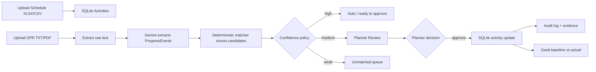
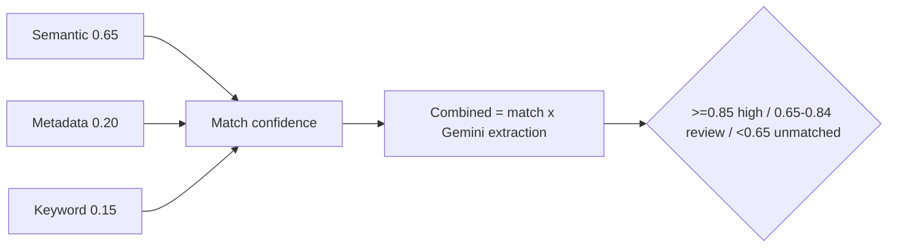

# SIH 2026 PPT CONTENT — Oildex (PS 26122)

> Grounded in the actual working prototype. Roadmap items are marked "(roadmap)". For Claude: build exactly 1 slide per section; keep bullets short; convert the mermaid diagrams into visuals.

---

## 1. IDEA TITLE
**Oildex — Real-Time Actual-Progress Bridge: Intelligent Data Capture & Schedule-Linking for Infrastructure Projects**

One-liner: *An LLM-powered bridge that turns messy daily field reports into governed, auditable schedule updates.*

---

## 2. PROPOSED SOLUTION

**Prototype (working end-to-end):**
- Ingests real files: schedule **XLSX/CSV** and field reports **TXT / text-PDF** (plus pasted logs) → stored in SQLite.
- **Gemini LLM** extracts structured "progress events": discipline, action, object/tag, date, status, quantity. The LLM **never writes to the schedule**.
- **Deterministic matcher** links each event to the correct L5/L6 baseline activity.
- **Confidence policy** routes work: high → auto, medium → planner review, weak → unmatched (never silently dropped).
- Planner **approve / reject / override** commits a **real database update** + **audit record** (source sentence, old→new values, confidence, timestamp).
- **Gantt (baseline vs actual)** and a persistent **Audit Log** reflect live DB state — survives refresh.

**How it addresses the problem:**
- Manual re-keying of DPRs → automated Gemini extraction with human-in-the-loop approval.
- Schedule "actuals" not auditable → every change carries evidence + audit trail.
- Drift detected too late → Gantt shows baseline vs actual + variance immediately.
- Field terms ≠ plan terms → synonym/text + metadata + keyword matching, not naive search.
- Unmatched/new work disappears → explicit unmatched queue for planner/change handling.

**Innovation & uniqueness:**
- **"AI may propose — governed logic commits"**: LLM extracts facts; deterministic rules + planner approval update the schedule. No silent AI corruption.
- **Explainable confidence** (3-part formula) instead of a black-box model.
- **Honest difficulty-tiered benchmark** design (easy / paraphrased / noisy / ambiguous / unmatched).
- **One audit-controlled loop**: ingestion → extraction → match → review → DB write → live Gantt.

---

## 3. TECHNICAL APPROACH

**Technologies used (prototype):**
- Frontend: React 19, TypeScript, Vite, Tailwind CSS
- Backend: Node.js + Express
- AI: Gemini (structured JSON extraction via `@google/genai`)
- Storage: SQLite (persistent, zero-setup)
- Parsing: XLSX (schedules), PDF text extraction (reports), plain text
- Matching: deterministic synonym-expansion + Dice/Jaccard text similarity + metadata/keyword rules

**Methodology / process (working prototype):**
- 5 product screens: Ingest → Extracted Events → Match Review → Schedule (Gantt) → Audit Log
- Demo kit includes a schedule `.xlsx` and DPR `.txt/.pdf` that run the full loop
- Build: `npm run server:dev` + `npm run dev`

---

## 4. FEASIBILITY & VIABILITY

**Feasibility analysis:**
- **Technically proven**: real files → parsing → Gemini → matching → review → SQLite write → Gantt; verified end-to-end.
- **Zero/low infra**: runs locally (SQLite); deploys as a simple static + API stack.
- **Low cost**: Gemini free tier suffices for a pilot (thousands of events/day budget not needed).
- **Staged rollout**: start text reports + one project; add breadth later.

**Challenges & risks → strategies:**

| Challenge / Risk | Why it occurs | Strategy |
|---|---|---|
| Scanned PDFs have no text | They are images; needs OCR | Accept text PDFs now; add OCR as roadmap; clearly reject scanned files |
| Semantic accuracy at scale | Deterministic similarity is limited vs true embeddings | Keep planner review tier; swap in embeddings/vector search behind same interface (roadmap) |
| No enterprise PMIS link | SQLite is the local schedule store today | Add Primavera/P6 XML import/export + DB persistence as enterprise step (roadmap) |
| Hallucinated/invented data | LLM can fabricate | LLM never writes; schema-constrained JSON; evidence preserved; planner gate |
| Demo data persists wrongly | Local DB accumulates test rows | One-command reset to clean seed |

**Impact & benefits:**
- **Planners/controls engineers**: faster, evidence-backed, auditable schedule updates; early slippage alerts.
- **Site supervisors**: report in their own words/files — no rigid forms.
- **Organization (Oil India/EPCs)**: governed "actuals" with provenance; institutional memory of real durations/delays (roadmap).
- **Economy/society**: more predictable infrastructure delivery, fewer disputes, better capital-project governance.
- **Scalability**: schedule-driven construction anywhere — oil & gas, power, highways, water (domain-agnostic pattern).

---

## 5. RESEARCH & REFERENCES
- Smart India Hackathon 2026 — Problem Statement **PS 26122** (official SIH portal).
- **Primavera P6 / PMI EVM concepts**: L5/L6 activities, baseline vs actual, SPI, data date, float, % complete (used throughout the data model & Gantt).
- **Gemini API docs** (`ai.google.dev`) — structured JSON output used for extraction (implemented).
- **Dice–Sørensen / Jaccard similarity** — basis of the implemented deterministic text-matching score.
- **BGE-M3 embeddings (arXiv:2402.03216)** — reference for the planned semantic-matching upgrade (roadmap).
- **PDF/XLSX parsing** libraries (pdf-parse, SheetJS) — used in the file pipeline.
- **MDN Web Speech API** — reference for the planned voice "time agent" (roadmap).

---

## 6. DIAGRAMS TO INCLUDE (for Claude to render)
1. Pain→Solution diagram: *manual reconciliation → one governed pipeline*.
2. End-to-end workflow flow (mermaid `flowchart LR` above).
3. Decision-policy strip (mermaid above).
4. UI screenshots: Ingest, Match Review (confidence + evidence), Schedule (Gantt baseline vs actual), Audit Log — capture live at `http://localhost:3000`.
5. Optional architecture diagram: React SPA ↔ Express API ↔ SQLite ↔ Gemini.
